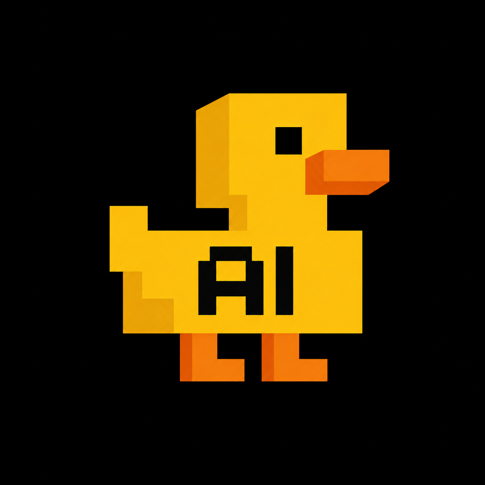

# Ducky AI | Coder

A browser-native coding agent console. The everything-is-a-plugin harness experience — streaming agent, tool calling, virtual workspace, permission gates — running entirely in your browser, powered by **your own model** — any OpenAI-compatible endpoint.



## What is this?

Ducky AI | Coder is a zero-config, self-hostable coding agent web app:

- **Bring your own model** — base URL + API key + model id in Settings → Connections (Discover lists models, Test verifies). Server env (`AI_*`) is only a shared fallback. Retries with backoff make the connection strong.
- **Streaming chat with tools** — the model calls tools across multiple iterations; results stream back as tool cards (per-tool icons, diff previews for edits, live output).
- **Virtual workspace** — a sandboxed filesystem stored in your browser (seeded with a sample repo). `read_file`, `write_file`, `edit_file`, `glob`, `grep` and a simulated `bash` (pipes, redirects, `&&` chains) all operate on it. Paste or import images, preview them, export everything as a valid `.zip`.
- **Everything is a plugin** — 27 plugins / 72 tools (`@ducky-ai/ducky-tool-fs`, `ducky-tool-bash`, `ducky-tool-todo`, `@ducky-ai/ducky-tool-mcp`, …). Toggling a plugin unloads its tools from the model's schema. `npm run test:tools` executes every tool (42 checks green).
- **Self-driving harness** — `get/set_config` lets the agent retune policy, temperature and budgets mid-run (gated); `session_list/new/rename/switch` manages parallel threads.
- **Text power tools** — `sort/dedupe/count` lines, `regex_edit` with `$1` groups, `preview_csv` tables, `workspace_stats` overviews.
- **Computer use** — `screen_capture` grabs a user-shared screen frame into `images/` (browser picker first, never silent) and `vision_describe` reads it; `disk_*` tools act on the real folder.
- **Browser use** — `browser_open` loads pages in the IDE browser panel, `browser_snapshot` reads their text, `browser_tabs`/`browser_close` manage tabs.
- **MCP connections** — `mcp_servers` / `mcp_list` / `mcp_call` talk to any Streamable-HTTP MCP server you register in Settings → Connections → MCP (Blender bridges, Roblox Studio bridges, browsers, filesystems).
- **Memory + skills** — `memory_save` persists facts across sessions (injected into the system prompt), `note_*` is the session scratchpad, and 16 skill playbooks (`skill_list`/`skill_show`: + `mcp-integration`, `api-design`, `sql`, `regex`, `git`, `perf`, `security-review`, `data-analysis`) discipline the agent.
- **Agent-first UI** — one prompt box with `@` context and `/` commands, suggestion chips, model + permission-mode row below the box (Ask before changes / Edit automatically / Plan mode / Read-only), allow-once / always-allow / deny approval cards, a task strip (goal + files + tokens), a bottom terminal over the workspace, and a browser tab for agent-opened pages.
- **Permission gates** — `auto` / `ask` / `readonly` policies; side-effecting tools raise an inline approval card.
- **Plan mode** — read-only research phase ending in an `exit_plan_mode` approval.
- **Subagents** — the `subagent` tool spawns a focused child agent loop with a restricted toolset and returns its report.
- **Connection guard** — without a key + model the composer says exactly what's missing (nothing fake, nothing simulated).
- **Activity ledger** — a git-log-style timeline of every prompt, tool call and file change, with filters, copyable shas, workspace rewind (time-travel) and conversation trim.
- **Command palette & slash commands** — `⌘P` palette (commands + sessions + files + all 70+ tools) plus 34 slash commands: `/goal`, `/retry`, `/undo`, `/compact`, `/models`, `/endpoint`, `/key`, `/conn`, `/temp`, `/tokens`, `/iters`, `/remember`, `/forget`, `/stats`, `/files`, `/reset`, `/rename`, `/star`, `/duplicate`, `/browser`, `/term`, `/screen`, `/tools`, `/mcp` — and the classic `/new`, `/clear`, `/plan`, `/model`, `/policy`, `/plugins`, `/activity`, `/export`, `/zip`, `/backup`, `/help`.

## Quickstart (one copy-paste)

```sh
curl -fsSL https://ducky-install.vercel.app | bash
```

One command to copy — nothing to edit. Two pastes at prompts, never inside
the command: (1) a GitHub token for the private download (`curl` asks for
the password — any fine-grained PAT with Contents: read works), (2) your
OWN endpoint key (every user needs their own key, so no installer on earth
can embed it). Fully non-interactive variant with flags is documented atop
`install.sh`.

> One-time setup (30 seconds): the short URL is a Vercel project
> (`ducky-install`) — open its dashboard → Settings → Deployment Protection
> → **Disabled**, otherwise the team login wall answers instead of the
> installer. A custom domain skips that wall entirely (and reads better
> than `*.vercel.app`) — say the word and I'll wire one up. Direct
> fallback: `curl -fsSL -u ducky https://raw.githubusercontent.com/TS-66/theducksdev/main/install.sh | bash`.

What the installer does: downloads the ref → `npm install` (or bun) →
`next build` → links the global `ducky` command (user-local shim when sudo is
unavailable) → `ducky setup` → `ducky --web`. Flags: `--dir`, `--ref`,
`--port`, `--host`, `--local <checkout>`, `--no-build`, `--no-link`,
`--no-run`, `--key`, `--model`, `--dry-run`. Or manually:

```sh
npm install
npm i -g .              # global `ducky` command (or use node ./bin/ducky.js)
ducky setup             # connect your endpoint (live-tested before saving)
ducky --web             # local popup at http://127.0.0.1:3000 — NOT a website
```

`ducky --web` binds loopback only: the UI is a popup on your own machine. `ducky setup --check` verifies the key with masked output (values are never printed).

## Configuration

Sessions, workspaces and settings live in the browser's `localStorage`. Your model key lives in **your browser** (Settings → Connections) or, as a shared fallback, in server env that never reaches the browser. Without a key + model the composer says exactly what's missing.

### Environment variables (optional)

Hiding order for the key: OS keychain (set via `ducky setup`) → shell env → locked file. Copy `.env.example` to `.env.local` for local dev, or set them in your hosting dashboard:

| Variable | Required | Description |
| --- | --- | --- |
| `AI_BASE_URL` | One source | Your OpenAI-compatible base URL (or set it per-user in Connections). |
| `AI_API_KEY` | One source | Bearer key — **server only, never in UI/git** (per-user keys live in their browser). |
| `AI_MODEL_ID` | One source | Model id your endpoint serves (or per-user in Connections). |
| `DUCKY_SECRETS_FILE` | No | Path to a JSON file your own database writes: `{"apiKey":"...","model":"...","baseUrl":"https://..."}`. Re-read per request, so key rotations apply live with no restart. Priority per field: env var wins, then this file. |

Base URL forms: `https://api.example.com/v1` (recommended), `https://api.example.com` (`/v1` appended on 404) or a pasted full `/v1/chat/completions` path (stripped).

> Note: `/api/chat` needs a key + model (yours or the server fallback), otherwise it returns an actionable 400. `/api/config` exposes booleans only — never secrets.

### Deploying (e.g. Vercel)

The app is serverless-ready out of the box. Push the repo to Git, import it into your platform, and add `AI_BASE_URL` / `AI_API_KEY` / `AI_MODEL_ID` as (Production) environment variables — no database, no blob storage, no extra services. Stream function durations are already tuned via the route's `maxDuration`.

### Run anywhere

The backend is intentionally **stateless** (sessions/workspace/settings live in the browser; `/api/chat` is a streaming pass-through proxy), so it runs on any Node/Bun host or serverless platform:

```sh
bun install
bun run dev        # development
bun run build && bun run start   # production
```

## Architecture

```
Browser (client)                          Server (stateless)
┌────────────────────────────┐            ┌─────────────────────┐
│  zustand + localStorage    │            │  /api/chat          │
│   sessions · workspace ·   │  fetch()   │   SSE pass-through  │──▶ your OpenAI-compatible
│   settings · plugins       │───────────▶│  /api/web-search    │──▶ search backend
│  agent loop                │            │  /api/web-fetch     │    endpoint (env-configured)
│   (src/lib/ducky/          │            │  /api/vision        │
│    agent-loop.ts)          │            └─────────────────────┘
│  tool executors on vFS     │
└────────────────────────────┘
```

- `src/lib/ducky/types.ts` — canonical wire/UI contract.
- `src/lib/ducky/models.ts` — model identity (display name = your configured id).
- `src/lib/ducky/plugins.ts` — plugin manifests + tool schemas.
- `src/lib/ducky/agent-loop.ts` — multi-iteration loop, SSE parsing, policy gate, subagent.
- `src/lib/ducky/tools-*.ts` — virtual FS, mini-bash, web tool fetchers.
- `src/hooks/use-ducky-agent.ts` — React ⇄ engine bridge (system prompt assembly, approvals).
- `src/app/api/chat/route.ts` — stateless streaming proxy + model-id mapping.

## Notes & limits

- The shell is a **safe simulation** over the virtual workspace — there is no real host execution (that's what keeps the app serverless-safe).
- Web tools degrade gracefully: when no backend is configured the model receives a structured error instead of crashing.
- Sessions, workspaces and settings never leave your browser except inside the proxied chat request.

## License

MIT.
